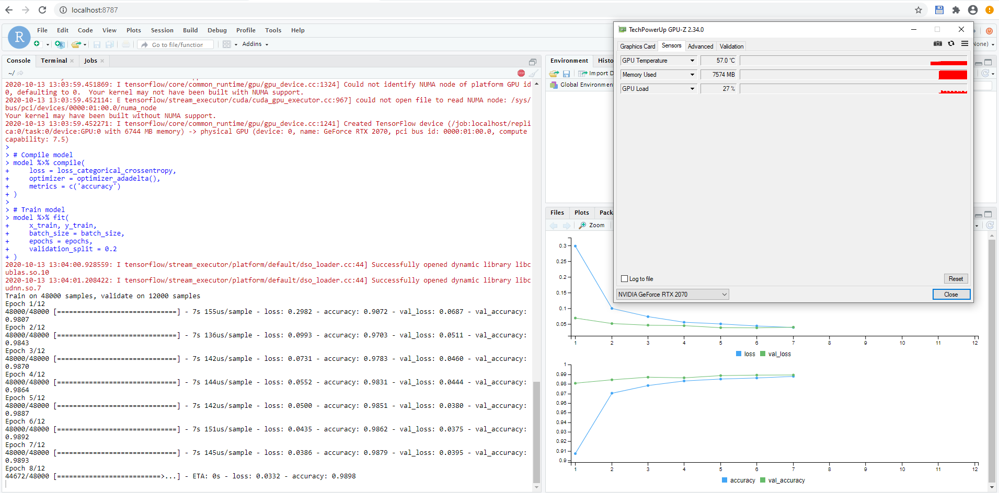
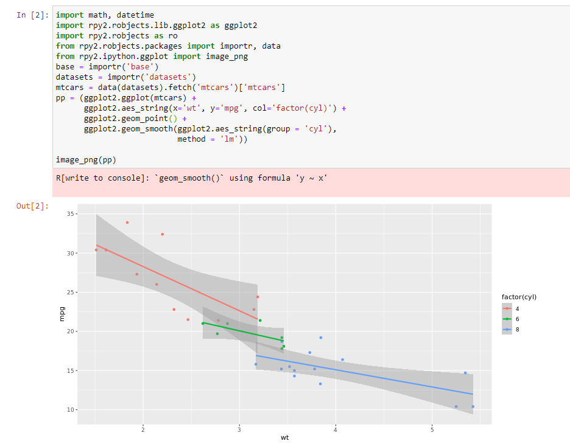

# GPU support in WSL 2 in practice: Jupyter notebooks and Rstudio working seamlessly with a GPU using docker containers.
If you are reading this blog, probably you are wondering whether a GPU can be shared by Windows. This is a real problem because in virtual machines hosted on Windows, GPU support doesn’t work properly or it’s really hard to set up.

Even docker cannot use GPUs in Linux containers running in Windows as host. The only real solution if you want to run GPU-based code in a Linux container in Windows is literally getting rid of Windows; meaning, having a dual boot with a Linux distribution and run it there. If this is your case, you should continue reading this blog.

**If you are already a WSL 2 user, additional improvements over the standard installation are described as automated docker initialization and Linux distros export to avoid reinstallation of standard programs.**

Moreover, a docker image was developed with both Jupyter notebooks and Rstudio able to use Tensorflow and Keras with a GPU if available. Furthermore, it will be shown that both R and Python installations can be used seamlessly by both UIs without additional configuration including GPU support. Finally, some caveats will be described, such as GPU support not working for latest Windows insider build (20231) and a decrease in performance.

The custom Docker image and its Dockerfile can be found [here](https://hub.docker.com/r/angelsevillacamins/gpu-py3-jupyter-rstudio) and [here](https://github.com/Anchormen/wsl2-gpu) respectively.
## 1. WSl 2 and docker in Windows 10.
Docker for windows is moving to a new architecture paradigm to improve the resource consumption, as described [here](https://docs.docker.com/docker-for-windows/wsl/). It’s called WSL 2, which is the abbreviation for Windows Subsystem for Linux. In general, it’s a lightweight virtual machine with a complete Linux kernel, which increases I/O performance. Now, resources sharing with the host Windows systems works seamlessly, especially file sharing. If you haven’t tried it yet, you should since it’s really easy to install and delivers exactly what it promises – a linux distribution within your Windows system with a simple integration. Moreover, Docker plans to use WSL 2 as primary engine in the short term and, in the future, the only way that Docker Desktop will be deployed.
## 2. GPU compute support in Windows.
When GPU support is needed for ML/AI the first decision that should be made is the environment. In my opinion, using the GPU directly on the host is dangerous. I already had some bad experiences trying to recreate the environment in another computer, for example, a server in the cloud. Because of that, I prefer dockerizing and keeping the environment under control. Until now, I could only use Linux to develop/test these environments. Since I use also Windows, the only solution was to use dual boot with Linux/Windows because there is no other way to run Linux GPU based containers in Windows. VMs doesn’t have native GPU support or is really hard to set up and Docker for Windows simply did not allow it as nvidia-docker was only supported for Linux. In May this year, Windows announced that WSL 2 will support GPU Computes and Ubuntu itself released on June a guide to run Jupyter Notebook in Docker with CUDA support in Windows using WSL 2 (see [here](https://ubuntu.com/blog/getting-started-with-cuda-on-ubuntu-on-wsl-2)).
## 3. WSL 2 configuration to include GPU support.
   ### 3.1. Windows version.
   As of the time of writing this blog, **GPU support works ONLY using the Official Windows 10 client Insider build 20201**. You can download it from [here](https://tb.32767.ga/products.php?prod=win10ip), and follow the steps provided [here](https://www.microsoft.com/software-download/windows10). Be aware that a Windows Insider program account is needed, check [here](https://insider.windows.com/en-us/) for additional details. Check running ```ver``` in the command line. It should match ```Microsoft Windows [Version 10.0.20201.1000]```.
   ### 3.2. WSL 2 installation
   WSL 2 installation should be straight forward following the official documentation [here](https://docs.microsoft.com/en-us/windows/wsl/install-win10) and GPU support [here](https://ubuntu.com/blog/getting-started-with-cuda-on-ubuntu-on-wsl-2) or [here](https://docs.nvidia.com/cuda/wsl-user-guide/index.html). For convenience, I’ve summarized it below for the windows command line:

  ```
  :: Enable WSL 2
  dism.exe /online /enable-feature /featurename:Microsoft-Windows-Subsystem-Linux /all /norestart
  dism.exe /online /enable-feature /featurename:VirtualMachinePlatform /all /norestart
  ```
    
   Restart Windows 10 and run:

  ```
  :: Set WSL 2 as the default version
  wsl.exe --set-default-version 2
  ```

   Then, install Ubuntu from the Microsoft Store as [here](https://www.microsoft.com/store/productId/9NBLGGH4MSV6) and continue with the following commands:

  ```
  :: Update the WSL 2 Linux kernel
  wsl.exe --update
  wsl --shutdown
  ```

   Finally, set up a new distro by running the newly installed Linux distribution and provide a user name and password.
   
   To check whether the installation was correct, run ```wsl cat /proc/version``` in a windows command line or ```cat /proc/version``` inside WSL 2. The outcome should be the following:
   
  ```
  Linux version 4.19.128-microsoft-standard
  ```

   ### 3.3. Nvidia drivers
   Go [here](https://developer.nvidia.com/cuda/wsl/download) and install the specific drivers required for your NVIDIA model.

   ### 3.4. Native docker for windows vs docker-ce in WSL2
   The natural next step could be the installation of Docker Desktop. However, NVIDIA Container Toolkit does not yet support Docker Desktop WSL 2 backend. Check [this](https://docs.nvidia.com/cuda/wsl-user-guide/index.html) out for additional details.
   
   Because of that, standard Docker-CE should be installed. Run the following command **INSIDE** WSL 2 Ubuntu distribution:

   ```
   curl https://get.docker.com | sh
   ```
   
   Then, install NVIDIA Container Toolkit running the following commands in two steps. First, setup the stable and experimental repositories:
   
   ```
   distribution=$(. /etc/os-release;echo $ID$VERSION_ID)

   curl -s -L https://nvidia.github.io/nvidia-docker/gpgkey | sudo apt-key add -

   curl -s -L https://nvidia.github.io/nvidia-docker/$distribution/nvidia-docker.list | sudo tee /etc/apt/sources.list.d/nvidia-docker.list

   curl -s -L https://nvidia.github.io/libnvidia-container/experimental/$distribution/libnvidia-container-experimental.list | sudo tee /etc/apt/sources.list.d/libnvidia-container-experimental.list
   ```
   
   and then, the NVIDIA runtime packages:
   
   ```
   sudo apt update && sudo apt install -y nvidia-docker2
   sudo usermod -a -G docker $USER
   ```
   
   Finally, close the WSL2 window and run the next command in the windows CLI to restart WSL 2:
   
   ```
   wsl --shutdown Ubuntu
   ```
   
   To check that everything was installed correctly, open a new WSL 2 window and execute the following command:
   
   ```
   sudo service docker start
   ```
   
   Open an additional WSL 2 window and execute the following command:
   
   ```
   docker run --gpus all nvcr.io/nvidia/k8s/cuda-sample:nbody nbody -gpu -benchmark
   ```
   
   The Nvidia graphic card should be automatically detected and it should show something similar to:
   
   ```
   > Windowed mode
   > Simulation data stored in video memory
   > Single precision floating point simulation
   > 1 Devices used for simulation
   MapSMtoCores for SM 7.5 is undefined.  Default to use 64 Cores/SM
   GPU Device 0: "GeForce RTX 2070" with compute capability 7.5

   > Compute 7.5 CUDA device: [GeForce RTX 2070]
   36864 bodies, total time for 10 iterations: 67.554 ms
   = 201.166 billion interactions per second
   = 4023.329 single-precision GFLOP/s at 20 flops per interaction
   ```

   ### 3.5. Automated docker initialization
   Most of the WSL 2 installation description ends here. I thought I was done with it. However, the more I was using WSL 2, starting every time the Docker Daemon the more painful it was. Naturally, I started looking for an easier way around this. That’s when I found [this](https://blog.nillsf.com/index.php/2020/06/29/how-to-automatically-start-the-docker-daemon-on-wsl2/) excellent blog with a very elegant solution to this problem, summarized in the following lines.

   Open a WSL 2 windows and run:
   
   ```
   sudo visudo
   ```
   
   At the end of the file, add the following line changing ```<USER_NAME>``` with the name of your linux user:
   
   ```
   <USER_NAME> ALL=(ALL) NOPASSWD: /usr/bin/dockerd
   ```
   
   In this way, your user can start the docker daemon without asking for the password. Save the modifications and run:
   
   ```
   echo '# Start Docker daemon automatically when logging in if not running.' >> ~/.bashrc
   echo 'RUNNING=`ps aux | grep dockerd | grep -v grep`' >> ~/.bashrc
   echo 'if [ -z "$RUNNING" ]; then' >> ~/.bashrc
   echo '    sudo dockerd > /dev/null 2>&1 &' >> ~/.bashrc
   echo '    disown' >> ~/.bashrc
   echo 'fi' >> ~/.bashrc
   ```
   
   With this script added to the bashrc, WSL 2 will check if the docker daemon was already initiated every time you open a WSL 2 window. If not, Docker will be started.
   
   To check whether this is working properly, just close all WSL 2 windows, run ```wsl --shutdown Ubuntu``` in the windows command line and open a new WSL 2 window. 
   
   The following command should run now without errors:
   
   ```
   docker run --gpus all nvcr.io/nvidia/k8s/cuda-sample:nbody nbody -gpu -benchmark
   ``` 

   ### 3.6. WSL2 distros export/import
   Another interesting WSL 2 feature is the ability to export/import distros. If a brand new WSL 2 distro is needed, all the previous steps should be repeated. To avoid that, the WSL 2 distro can be exported and used as a “clean” template.
   
   To do that run the following commands in the Windows command line, changing ```<PATH>``` with the path in which the distro export file should be copied, for example, ```C:\wslbackup```:

   ```
   SET wsl2_export_path=<PATH>
   mkdir %wsl2_export_path%
   wsl --export Ubuntu %wsl2_export_path%\ubuntu.tar
   ```

   From now on, this tar file can be used as a template. For that:

   - Change ```<PATH>``` with the path in which Windows will store the WSL 2 files of the new distro, for example, ```C:\wsl```.
   - Change ```<DISTRO_NAME>``` with the name of the new distro, for example, ```ubuntu_gpu```.

   ```
   SET wsl2_import_path=<PATH>
   SET distro_name=<DISTRO_NAME>
   mkdir %wsl2_import_path%\%distro_name%
   wsl --import %distro_name% %wsl2_import_path%\%distro_name% %wsl2_export_path%\ubuntu.tar
   ```
   
   Check with:
   
   ```
   wsl --list
   ```
   
   The only caveat is that the user name can only be set as default in the Ubuntu distro, but not in those imported. Because of that, the following commands should be run to initiate a new WSL 2 distro with a specific user and avoid starting always as root:
   
   ```
   SET distro_name=<DISTRO_NAME>
   SET user_name=<USER_NAME>
   wsl --distribution %distro_name% --user %user_name%
   ```
   
   If distros grow in size, they should be deleted as follows, **BE CAREFUL, IT CANNOT BE UNDONE**:
   
   ```
   SET distro_name=<DISTRO_NAME>
   :: wsl --unregister %distro_name% 
   ```
   
   ### 3.7. VS Code connection using docker-ce in WSL2
   VS Code connection can still be used even though docker-ce was preferred over the Windows version. Install VS code as [here](https://code.visualstudio.com/blogs/2020/07/01/containers-wsl). 
   
   Add Remote WSL and docker extensions. After those were installed, restart VS code and press install in WSL when required.

## 4. Integration of WSL2 with Jupyter notebooks and Rstudio including GPU support via docker images.
To show the possibilities of WSL 2 with GPU support, three use cases were deployed:
  - Jupyter notebook running a Keras model using a gpu.
  - Rstudio running a Keras model using a gpu.
  - Jupyter notebook running R code.

   ### 4.1. Jupyter notebook running a Keras model using a gpu.
   This is the easiest since Tensorflow provides already a docker image which works directly in WSL 2 (see [here](https://docs.nvidia.com/cuda/wsl-user-guide/index.html)).
   
   Just running the following command within WSL 2 should provide a running Jupyter notebook with GPU support:
   
   ```
   docker run -u $(id -u):$(id -g) -it --gpus all -p 8888:8888 tensorflow/tensorflow:latest-gpu-py3-jupyter
   ```
   
   WSL 2 should also make available the connection with the WSL 2 endpoint automatically. 
   
   Copy the url provided by tensorflow and just change 127.0.0.1 with localhost, for example, ```http://localhost:8888/?token=d60b82ee96f7785fcfee6e3b69637f435baec82216510e37``` and paste into your preferred web explorer. 
   
   This image provides some notebooks as example under "tensorflow tutorials". To check whether the gpu is being used, check the WSL 2 console while training a model, it should like this:

   ```
   I tensorflow/core/common_runtime/gpu/gpu_device.cc:1241] Created TensorFlow device (/job:localhost/replica:0/task:0/device:GPU:0 with 6745 MB memory) -> physical GPU (device: 0, name: GeForce RTX 2070, pci bus id: 0000:01:00.0, compute capability: 7.5)
   I tensorflow/stream_executor/platform/default/dso_loader.cc:44] Successfully opened dynamic library libcublas.so.10
   ```

   ### 4.2. Rstudio running a Keras model using a gpu.
   This one is a bit trickier. Rocker project developed docker images with CUDA support; however, I was not able to run them directly on WSL 2 and the connection with Python was cumbersome.
   
   Since the Tensorflow image was working properly, the easiest way to proceed was to use this image as base and install R and RStudio. That seemed to work fine. Rocker project has done an amazing job in the image building and it was relatively easy to make the link. Just some tips when you are doing:

   - The most important part is the connection of R with python. [According to this source](https://tensorflow.rstudio.com/installation/custom/), it should be done via the RETICULATE_PYTHON environmental variable. In order to make available not only to R but also to Rstudio, it was set using the /etc/R/Rprofile.site file.
   - Rocker installed R dependencies using install.packages() and [littler](https://github.com/eddelbuettel/littler). However, Dirk Eddelbuettel presented one year ago the 'marutter c2d4u PPA'. As they explained, "It provides over 4,000 r-cran-* binary packages with proper dependencies automatically resolved within Ubuntu 18.04". Luckily, tensorflow image is also based on Ubuntu 18.04, making the tensorflow image compatible with the marutter PPA.  Because of that, the needed R dependencies, like Keras or ggplot2, were installed using the marutter PPA and install.packages and littler commands were removed.
   - For the next use case, rpy2 Python package was installed, which allows you to run R code within a Python session.
   - Some small changes were done in the script files that rocker project provides for RStudio installation. For example, any reference or installation of CUDA were commented or script files references were changed to the folder /script.
  
   Custom Docker images can be found on Docker Hub [here](https://hub.docker.com/r/angelsevillacamins/gpu-py3-jupyter-rstudio) and docker files and scripts used [here](https://github.com/Anchormen/wsl2-gpu).
   Running the following command within WSL 2 should provide a running Rstudio session with the GPU support:
   
   ```
   docker run -it --gpus all -e PASSWORD=ms -p 8787:8787 -p 8888:8888 angelsevillacamins/gpu-py3-jupyter-rstudio
   ```
   
   Run the following Keras model from [here](https://keras.rstudio.com/articles/examples/mnist_cnn.html) to test the GPU support:

  ```
  library(keras)

  # Data Preparation -----------------------------------------------------

  batch_size <- 128
  num_classes <- 10
  epochs <- 12

  # Input image dimensions
  img_rows <- 28
  img_cols <- 28

  # The data, shuffled and split between train and test sets
  mnist <- dataset_mnist()
  x_train <- mnist$train$x
  y_train <- mnist$train$y
  x_test <- mnist$test$x
  y_test <- mnist$test$y

  # Redefine  dimension of train/test inputs
  x_train <- array_reshape(x_train, c(nrow(x_train), img_rows, img_cols, 1))
  x_test <- array_reshape(x_test, c(nrow(x_test), img_rows, img_cols, 1))
  input_shape <- c(img_rows, img_cols, 1)

  # Transform RGB values into [0,1] range
  x_train <- x_train / 255
  x_test <- x_test / 255

  cat('x_train_shape:', dim(x_train), '\n')
  cat(nrow(x_train), 'train samples\n')
  cat(nrow(x_test), 'test samples\n')

  # Convert class vectors to binary class matrices
  y_train <- to_categorical(y_train, num_classes)
  y_test <- to_categorical(y_test, num_classes)

  # Define Model -----------------------------------------------------------

  # Define model
  model <- keras_model_sequential() %>%
    layer_conv_2d(filters = 32, kernel_size = c(3,3), activation = 'relu',
                  input_shape = input_shape) %>%
    layer_conv_2d(filters = 64, kernel_size = c(3,3), activation = 'relu') %>%
    layer_max_pooling_2d(pool_size = c(2, 2)) %>%
    layer_dropout(rate = 0.25) %>%
    layer_flatten() %>%
    layer_dense(units = 128, activation = 'relu') %>%
    layer_dropout(rate = 0.5) %>%
    layer_dense(units = num_classes, activation = 'softmax')

  # Compile model
  model %>% compile(
    loss = loss_categorical_crossentropy,
    optimizer = optimizer_adadelta(),
    metrics = c('accuracy')
  )

  # Train model
  model %>% fit(
    x_train, y_train,
    batch_size = batch_size,
    epochs = epochs,
    validation_split = 0.2
  )

  scores <- model %>% evaluate(
    x_test, y_test, verbose = 0
  )

  # Output metrics
  cat('Test loss:', scores[[1]], '\n')
  cat('Test accuracy:', scores[[2]], '\n')
  ```

   The expected output is shown in the following figure:



<figcaption>Figure 1. Running a Keras model in R using python Tensorflow backend</figcaption>

   ### 4.3. Jupyter notebook running R code.
   Just as a bonus, R code can be run on a Jupyter notebook since the image has a functional R installation.

   Open a new python 3 notebook and run the following code from [here](https://rpy2.github.io/doc/latest/html/notebooks.html) and [here](https://rpy2.github.io/doc/latest/html/graphics.html#graphics):
   
   ```
   import math, datetime
   import rpy2.robjects.lib.ggplot2 as ggplot2
   import rpy2.robjects as ro
   from rpy2.robjects.packages import importr, data
   from rpy2.ipython.ggplot import image_png
   base = importr('base')
   datasets = importr('datasets')
   mtcars = data(datasets).fetch('mtcars')['mtcars']
   pp = (ggplot2.ggplot(mtcars) +
         ggplot2.aes_string(x='wt', y='mpg', col='factor(cyl)') +
         ggplot2.geom_point() +
         ggplot2.geom_smooth(ggplot2.aes_string(group = 'cyl'),
                             method = 'lm'))

   image_png(pp)
   ```
   
   The expected output is shown in the following figure:



<figcaption>Figure 2. Plotting a ggplot2 figure in a Jupyter Notebook using R backend</figcaption>

## 5. Caveats
1. GPU support for WSL 2 is not officially released and it’s not working for the latest Windows Insider build – GPU support is the most wanted feature of WSL 2. However, it’s not fully implemented yet in regular updates. Even GPU support for the newest Windows 10 Insider build (20231) is not working and I had to install the previous build (20201) to make WSL 2 work with GPU compute support.

2. Performance – Around 20% decrease in performance can be seen. Recently, NVIDIA updated the drivers for a higher performance, see more details [here](https://news.developer.nvidia.com/preview-for-cuda-on-wsl-updated-for-performance/).

## 6. Conclusions
In this blog, we introduced WSL 2, which will be the default engine for Docker in Windows in the near future. Then, we summarized the necessary WSL2 configuration which is required for GPU support. We also developed a docker image able to run Jupyter notebooks and RStudio including GPU support. Using this image, Python and R installations are shared by both UIs. Finally, we gave examples of both combinations – R code within Jupyter notebooks (ggplot2 plot) and Python in Rstudio (Keras model).